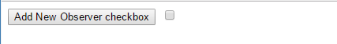
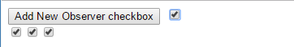

# Observer(观察者)模式

## 1. 简介

Observer模式指的是：一个对象(Subject)维持一系列依赖于它(Observer)的对象，将有关状态的任何变更自动通知给它们。当我们不再希望某个特定的观察者获得其注册目标发出的改变通知时，该目标可以将它从观察者列表中删除。

可以看出Observer模式的实现包含了以下两个部分：

1. 抽象的部分：

    1. Subject（目标）：维护一系列的观察者，方便添加或删除观察者，发出通知等。
    2. Observer（观察者）：为那些在目标状态发生改变时需获得通知的对象提供了一个更新接口。

2. 具体的部分：

    1. ConcreteSubject（具体目标）：状态发生变化时，向Observer发出通知，存储ConcreteObserver的状态。
    2. ConcreteObserver（具体观察者）：存储一个指向ConcreteSubject的引用，实现Observer的更新接口，以使自身状态与目标的状态保持一致。

抽象的部分实现了一个观察者模式的基本架构，具体的部分则是实现

1. 定义抽象部分的Subject的具体的状态变化，并在状态变化的时候发出通知
2. 实现Observer的更新接口

## 2. 完整示例

我们先从底层的存储开始，先实现一个列表，它可以提供添加、删除、查找的功能的。

```javascript
function ObserverList() {
    this.observerList = [];
}
ObserverList.prototype = {
    constructor : ObserverList,
    add : function (obj) {
        return this.observerList.push(obj);
    },
    removeAt : function (index) {
        this.observerList.splice(index, 1);
    },
    indexOf : function (obj, startIndex) {
        var i = startIndex || 0,
            len = this.observerList.length;
        while ( i < len) {
            if(this.observerList[i++] == obj) {
                return i;
            }
        }
        return -1;
    },
    get : function (index) {
        if (index > -1 && index < this.observerList.length) {
            return this.observerList[index];
        }
    },
    count : function () {
        return this.observerList.length;
    }
};
```

在这个的基础上，我们来构建抽象的Subject，它所需要的工作就是

1. 维护一个观察者列表（增加，删除），底层的实现就可以用第一步中的observerList
2. 发送通知给所有的观察者，调用它们的更新方法。

```javascript
function Subject() {
    this.observers = new ObserverList();
}
Subject.prototype = {
    constructor : Subject,
    addObserver : function (observer) {
        this.observers.add(observer);
    },
    removeObserver : function (observer) {
        var index = this.observers.indexOf(observer);
        if(index > -1) {
            this.observers.removeAt(index);
        }
    },
    notify : function (context) {
        var observerCount = this.observers.count();
        for( var i = 0; i < observerCount; i++){
            this.observers.get(i).update(context);
        }
    }
}
```

抽象的Observer就只需要一个接口，这个接口需要在具体的观察者中定义

```javascript
function Observer() {
    this.update = function (){};
}
```

有了以上的基础框架之后，来一个具体的例子，页面上有一个checkbox，它是一个ConcreteSubject，还有一个button，点击button可以添加一个checkbox，后面添加的checkbox都作为ConcreteObserver，第一个checkbox勾选的状态的变化会通知到后面添加的各个checkbox。

```html
<!DOCTYPE html>
<html lang="en">
<head>
    <meta charset="UTF-8">
    <title>Document</title>
</head>
<body>
    <button id="addNewObserver">Add New Observer checkbox</button>
    <input id="mainCheckbox" type="checkbox"/>
    <div id="observersContainer"></div>
</body>
</html>
```

我们来添加ConcreteSubject和ConcreteObserver，

```javascript
function extend( obj, extension ){
  for ( var key in extension ){
    obj[key] = extension[key];
  }
}

var controlCheckbox = document.getElementById( "mainCheckbox" ),
  addBtn = document.getElementById( "addNewObserver" ),
  container = document.getElementById( "observersContainer" );
 
extend( controlCheckbox, new Subject() );
 
controlCheckbox.onclick = function(){
  controlCheckbox.notify( controlCheckbox.checked );
};
 
addBtn.onclick = addNewObserver;
 
function addNewObserver(){
 
  var check = document.createElement( "input" );
  check.type = "checkbox";

  extend( check, new Observer() );
  check.update = function( value ){
    this.checked = value;
  };
  controlCheckbox.addObserver( check );
  container.appendChild( check );
}
```

运行效果图





## 3. 总结

在JavaScript中，注重Observer模式是很有用的，但是一般来说，我们都会使用Observer模式的一个变种[Publish/Subscribe模式](./pub-sub.md)。

总结起来，这两种模式的优点

1. 它们鼓励我们努力思考应用程序不同部分之间的关系，它们也帮助我们识别包含直接关系的层，并且可以用目标集和观察者进行替换，从而将应该程序分解为更小、更松散耦合的块，以改进代码管理和潜在的复用。
2. 更进一步来说，当我们需要维护相关对象的一致性的时候，我们可以避免对象之间的紧密耦合。

当然，这两种模式也有自己的一些缺点。

1. 由于发布者和订阅者松散耦合，当订阅者无法正常工作时，发布者无法感知，因此也很难确保我们应用中的特定部分可以按照我们预期的那样正常工作。
2. 此外，订阅者对彼此之间存在是没有感知，对切换发布者的代价无从得知，因为订阅者和发布者之间的动态关系，更新依赖也很难去追踪。

