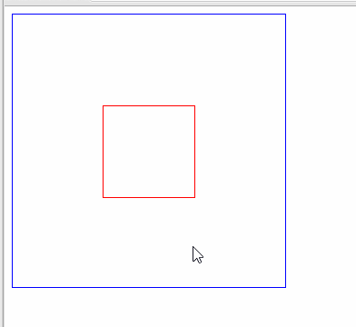

# 移入移出效果

使用css的`:hover`伪类选择器来实现移入移出的效果。

```html
<!DOCTYPE html>
<html lang="en">
<head>
    <meta charset="UTF-8">
    <title>Document</title>
    <style>
        .b{
            width : 300px;
            height : 300px;
            border : 1px solid blue;
        }
        .c {
            display:none;
            width : 100px;
            height : 100px;
            margin : 100px auto;
            border : 1px solid red;
        }
        .b:hover .c{
            display:block;
        }
    </style>
</head>
<body>
    <div class="b">
        <div class="c"></div>
    </div>
</body>
</html>
```

当鼠标已入b时，就会出现c，移除b时，则c消失。效果如下：




