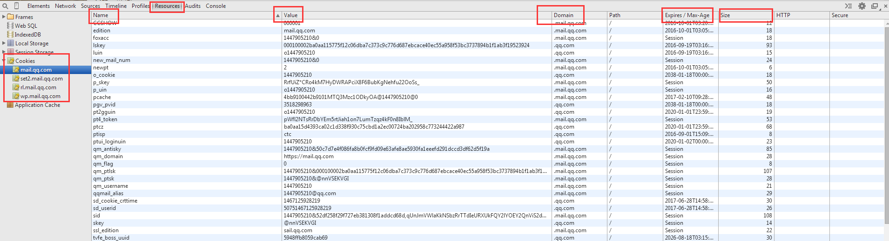
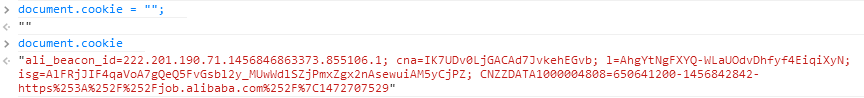

# cookie

> 随着Web应用程序的出现，也产生了对于能够直接在客户端上存储用户信息能力的要求。想法很
合乎逻辑，属于某个特定用户的信息应该存在该用户的机器上。无论是登录信息、偏好设定或其他数据，Web应用提供者发现他们在找各种方式将数据存在客户端上。这个问题的第一个方案是以cookie的形式出现的，cookie 是原来的网景公司创造的。一份题为“Persistent Client State: HTTP Cookes”（持久客户端状态：HTTP Cookies） 的标准中对cookie 机制进行了阐述（该标准还可以在这里看到：http://curl.haxx.se/rfc/cookie_spec.html）。今天，cookie 只是在客户端存储数据的其中一种选项。

## 1. 概述

### 1.1 认识cookie

HTTP Cookie，通常直接叫做cookie，最初是在客户端用于存储会话信息的。该标准要求服务器对
任意HTTP 请求发送Set-Cookie HTTP头作为响应的一部分，其中包含会话信息。

```shell
HTTP/1.1 200 OK
Content-Type: text/html
Set-Cookie: name=value
```

这个HTTP响应设置以name/value的形式来设置一个cookie，注意，name和value都必须是URL编码，浏览器会存储这个会话信息，并在这之后，通过每个请求添加Cookie HTTP头部信息发送会服务器：

```shell
GET /index.html HTTP/1.1
Cookie: name=value
```

### 1.2 限制

cookie在性质上是绑定在特定的域名下的，当设定了一个cookie后，再给创建它的域名发送请求时，都会包含这个cookie。

由于cookie是存在客户端计算机的，还必须保证它不会被恶意使用，且不会占据太多的磁盘空间。因此，每个域的cookie总数是有限的。

|浏览器|限制个数|
|:--|:--|
|IE6|20|
|IE6+|50|
|Firefox|50|
|Opera|50|
|Safari/Chrome|没有硬性规定|

需要注意的是，当设置的cookie超过单个域名的个数限制时，浏览器就会清除以前设置的cookie，而且IE和Opera会使用LRU算法来清除，Firefox看上去则好像是随机清除，因此要考虑cookie限制，以免出现不可预期的结果。

此外，浏览器中对于同个域下的cookie的尺寸也有限制，大多数浏览器都会大约4096B（加减1）的长度限制。为了最佳的浏览器兼容性，最好整个cookie长度限制在4095B以内。

### 1.3 构成

cookie在浏览器都可以看到，如图所示：



可以看到cookie的构成

|构成|说明|
|:--|:--|
|名称|一个唯一确定cookie的名称，不区分大小写，但是由于要传输到服务器，在服务器端可能会区分大小写，最好是区分大小写，此外，还必须经过URL编码|
|值|存储cookie中的字符串，值必须被URL编码，注意是字符串|
|域|表明cookie对于哪个域是有效的，且对于这个域的子域也是有效的，如果没有明确设定，那么这个域会被认作来自设置cookie的那个域|
|路径|对于指定域中的那个路径，应该向服务器发送cookie|
|失效时间|表示cookie合适应该被删除，在默认情况下，浏览器会话结束时会将所有的cookie删除，不过也可以通过设置cookie的失效时间来将cookie存储到用户的机器上。如果设置的失效时间是以前的时间，则cookie会被立刻删除|
|安全标志|指定后，cookie只有在使用SSL连接的时候才发送到服务器（HTTPS）|

### 1.4 总结

* cookie是一种WEB服务器通过浏览器在访问者的硬盘上存储信息的手段。
* 浏览器一般只允许存放300个cookie，每个站点最多存放20个Cookie，
* 每个Cookie的大小限制为4KB
* cookie会包含在http的请求头，发送到服务器端，与h5存储最大的区别
* cookie只能给同个域名下的js访问
* 会话cookie：如果不设置过期时间，则表示这个cookie生命周期为浏览器会话期间
* 持久cookie：如果设置了`过期时间`，浏览器就会把cookie保存到硬盘上，关闭后再次打开浏览器，这些cookie依然有效直到超过了设定的时间
* 存储在硬盘上的cookie可以在不同的浏览器进程间共享

### 1.5 cookie的作用

* 能使站点跟踪特定访问者的次数、最后的访问时间等
* 告诉在线广告商广告被点击的次数，从而可以更精确的投放广告
* 在有效期限未到时，cookie能使用户在不键入密码和用户名的情况下进入曾经浏览过的一些站点


## 2. 实现

在JavaScript中处理cookie有些麻烦，因为其接口是BOM的document.cookie属性，我们通过这个属性来操作cookie。这个接口有以下特点：


* 获取cookie的字符串是一系列由分号隔开的name/value，且name和value都是经过URL编码的

    ```javascript
    name1=value1;name2=value2;name3=value3
    ```

* 设置document.cookie不会覆盖cookie，除非cookie的名称已经存在。

    ```javascript
    // 设置document.cookie
    document.cookie = "";
    document.cookie;
    ```

    运行结果为：

    

    *将cookie设置为空，并不能清除cookie，因为是不会覆盖的*

### 2.1 创建和存储cookie

1. cookie是保存在`document.cookie`中，设置的时候一般会采取`key=value;expires=时间`。

2. `document.cookie`只会执行添加或者修改操作，不能删除里面已添加的值

```javascript
function setCookie(name,value,expiredays){

    //设置cookie有效期
    var d=new Date();
    d.setDate(d.getDate()+expiredays);

    var expires='expires='+d.toUTCString();

    //存储cookie，document.cookie
    document.cookie=name+'='+value+';'+expires;
}
```
### 2.2 获取cookie

思路：读取`document.cookie`的值，然后进行分割成数组，再进行匹配

```javascript
function getCookie(name){

    var name=name+'=',
        ca=document.cookie.split(';'), //cookie字符串
        i,len;

    for(i=0,len=ca.length;i<len;i++){
        var c=ca[i];
        //处理空格
        while(c.charAt(0) === ' ') c = c.substring(1);
        if(c.indexOf(name) != -1) return c.substring(name.length,c.length);
    }

    return '';
}
```

### 2.3 清除cookie

原理：设置cookie过期，

```javascript
function clearCookie(name){
    setCookie(name,'',-1);
}
```

## 综合实现

```javascript
(function () {

    var util = {
        setCookie : function(name, value, opt){
            var decode = encodeURIComponent;
            var r = decode(name) + "=" + decode(value);
            if(opt.domain){
                r += ";domain=" + opt.domain;
            }
            if(opt.path){
                r += ";path=" + opt.path;
            }
            var expires = opt.expiresdays ? opt.expiresdays : 30;
            var today = new Date();
            today.setDate(today.getDate() + expires);
            r += ";expires=" + today.toUTCString() + ";";
            document.cookie = r;
        },
        getCookie : function(name){
            return (a = document.cookie.match(new RegExp("(?:^|;)\\s*" + name + "=([^;]*)"))) ? a[1] : "";
        },
        clearCookie : function(name){
            this.setCookie(name, "", {expiresdays : -1});
        }
    }

    this.util = util;
    
})(this);
```

## 来源

1. 《JavaScript高级程序设计》