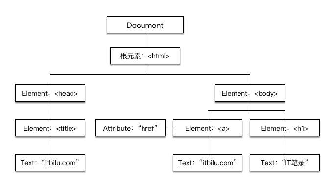

# DOM 

## 1. 概述

DOM(文档对象模型)脱胎于Netscape及微软创始的DHTML，它是针对HTML和XML文档的一个API。DOM描绘了一个层次化的节点树，允许开发人员添加、移除和修改页面的某一部分。

DOM被分为不同的部分

* 核心 - 针对任何结构化文档的标准模型 
* XML - 针对XML文档的标准模型 
* HTML - 针对HTML文档的标准模型

此外，DOM也分为3个级别（DOM Level 1/2/3）。

> 当阅读与DOM有关的材料时，可能会遇到参考0级DOM的情况。需要注意的是并没有标准被称为0级DOM，它仅是DOM历史上一个参考点（0级DOM被认为是在Internet Explorer 4.0 与Netscape Navigator4.0支持的最早的DHTML）。

### 1.1 DOM 1级

1级DOM在1998年10月份成为W3C的提议，由DOM核心与DOM HTML两个模块组成。DOM核心能映射以XML为基础的文档结构，允许获取和操作文档的任意部分。DOM HTML通过添加HTML专用的对象与函数对DOM核心进行了扩展。

### 1.2 DOM 2级

鉴于1级DOM仅以映射文档结构为目标，DOM 2级面向更为宽广。它可以分为几个模块

* DOM2级核心: 在1级核心的基础上构建，为节点添加了更多的方法和属性
* DOM2级视图: 描述跟踪一个文档的各种视图（使用CSS样式设计文档前后）的接口
* DOM2级事件: 描述事件接口
* DOM2级样式: 描述处理基于CSS样式的接口
* DOM2级遍历与范围: 描述遍历和操作文档树的接口
* DOM2级HTML: 在1级的HTML基础上构建，添加了更多的属性、方法和新接口。

### 1.3 DOM 3级

DOM3级又增加了XPath模块和加载与保存（Load and Save）模块。

## 2. 节点树

在DOM中，HTML和XML文档被描述一个由多层结构的不同类型的节点组成的节点树。组成DOM的不同类型的节点，每种节点都有各自的特点、方法和数据，节点之间通过不同的关系（父子、兄弟等）构成层次结构。

```html
<html>
  <head>
    <title>itbilu.com</title>
  </head>
  <body>
    <h1>IT笔录</h1>
    <a href="itbilu.com">itbilu.com</p>
  </body>
</html>
```

此文档DOM表示的树状图为：



树形的根部是Document节点，它代表整个文档，代表HTML元素的节点是Element节点，代表文本的节点是Text节点。Document、Element和Text是Node的子类。

> IE中的所有DOM对象都是以COM对象的形式来实现的，这意味着IE中的DOM对象与原生的JavaScript对象的行为或活动特点并不一致。

## 参考

1. [JavaScript HTML DOM介绍](http://itbilu.com/javascript/js/N1Gl2nwZl.html)
2. 《JavaScript高级程序设计》
3. 《JavaScript权威指南》