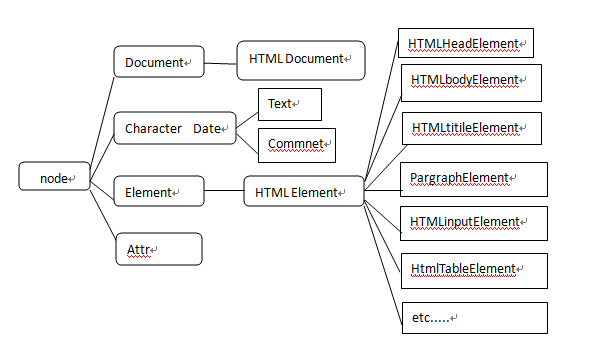

# 节点类型简介

## Node类型

Dom文档树中的每一个节点都是一个Node类型，下面来看看Node类型和它的子类。

|节点类型|描述|
|:--|:--|
|Document|表示整个文档（DOM树的根节点）|
|DocumentFragment|表示轻量级的Document对象|
|DocumentType|为文档定义的实体提供接口|
|ProcessingInstruction|表示XML文档中的一个处理指令，在HTML不会遇到|
|EntityReference|表示实体引用元素|
|Element|元素|
|Attr|属性|
|Text|表示元素或属性中的文本内容|
|CDATASection|表示文档中的CDATA区段（文本不会被解析器解析）|
|Entity|表示实体|
|Notation|表示在DTD中声明的符号|

###  NodeType

依据NodeType我们可以判定一个节点的类型

|NodeType|常量|
|:--|:--|
|1|ELEMENT_NODE|
|2|ATTRIBUTE_NODE|
|3|TEXT_NODE|
|4|CDATA\_SECTION\_NODE|
|5|ENTITY\_REFERNCE\_NODE|
|6|ENTITY_NODE|
|7|PROCESSING\_INSTRUCTION\_NODE|
|8|COMMENT_NODE|
|9|DOCUMNET_NODE|
|10|DOCUMENT\_TYPE\_NODE|
|11|DOCUMENT\_FRAGMENT\_NODE|
|12|NOTATION_NODE|

