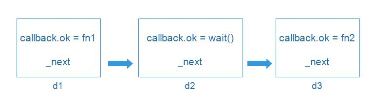
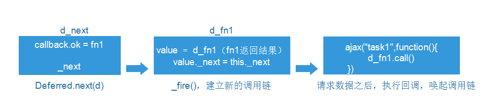

# jsdeferred学习解析

## 1. 基础介绍

JSDeferred的作者是cho45，是javascipt在异步编程上的一个里程碑式作品，值得好好学习。

## 2. API源码解析

### 2.1 构造函数

这里使用了`安全的构造函数`，避免了在没有使用new调用构造函数时出错的问题，提供了两个形式俩获取Deferred对象实例。

```javascript
function Deferred() {
    return (this instanceof Deferred) ? this.init() : new Deferred();
}

// 方式1 
var o1 = new Deferred();
// 方式2
var o2 = Deferred();
```

### 2.2 Deferred.define()

这个方法可以包装一个对象，指定对象的方法，或者将Deferred对象的方法直接暴露在全局作用域下，这样就可以直接使用。

```javascript
Deferred.methods = ["parallel", "wait", "next", "call", "loop", "repeat", "chain"];
/*
    @Param obj 赋予该对象Deferred的属性方法
    @Param list 指定属性方法
*/
Deferred.define = function(obj, list){
    if(!list)list = Deferred.methods;
    // 获取全局作用域的技巧，利用立即执行函数的作用域为全局作用域的技巧
    if(!obj) obj = (function getGlobal(){return this})();
    // 将属性都挂载到obj上
    for(var i = 0; i < list.length; i++){
        var n = list[i];
        obj[n] = Deferred[n];
    }
    return Deferred;
}

this.Deferred = Deferred;
```

### 2.3 异步的操作实现

在JSDeferred中有许多异步操作的实现方式，也是作为这个框架最为出彩的地方，方法依次是：

1. script.onreadystatechange（针对IE5.5~8）
2. img.onerror/img.onload（针对现代浏览器的异步操作方法）
3. 针对node环境的，使用process.nextTick来实现异步调用（已经过时）
4. setTimeout（default）

它会视浏览器选择最快的API。

1. 使用script的onreadystatechange事件来进行，需要注意的是由于浏览器对并发请求数有限制，（IE5.5~8为2~3，IE9+和现代浏览器为6），当并发请求数大于上限时，会让请求的发起操作排队执行，导致延时更严重。代码的思路是以150ms为一个周期，每个周期以通过setTimeout发起的异步执行为起始，周期内的其他异步执行操作通过script请求实现，如果此方法被频繁调用的话，说明达到并发请求数上限的可能性越高，因此可以下调一下周期时间，例如设为100ms，避免因排队导致的高延时。

    ```javascript
    Deferred.next_faster_way_readystatechange = ((typeof window === "object") && 
        (location.protocol == "http:") && 
        !window.opera &&
        /\bMSIE\b/.test(navigator.userAgent)) &&
        function (fun) {
        var d = new Deferred();
        var t = new Date().getTime();
        if(t - arguments.callee._prev_timeout_called < 150){
            var cancel = false; // 因为readyState会一直变化，避免重复执行
            var script = document.createElement("script");
            script.type = "text/javascript";
            // 发送一个错误的url，快速触发回调，实现异步操作
            script.src = "data:text/javascript,";
            script.onreadystatechange = function () {
                if(!cancel){
                    d.canceller();
                    d.call();
                }
            };

            d.canceller = function () {
                if(!cancel){
                    cancel = true;
                    script.onreadystatechange = null;
                    document.body.removeChild(script);// 移除节点
                }
            }；

            // 不同于img，需要添加到文档中才会发送请求
            document.body.appendChild(script);
        } else {
            // 记录或重置起始时间
            arguments.callee._prev_timeout_called = t; 
            // 每个周期开始使用setTimeout
            var id = setTimeout(function (){ d.call()}, 0);
            d.canceller = function () {clearTimeout(id)};
        }
        if(fun)d.callback.ok = fun;
        return d;
    }
    ```


2. 使用img的方式，利用src属性报错和绑定事件回调的方式来进行异步操作

    ```javascript
    Deferred.next_faster_way_Image = ((typeof window === "object") &&
        (typeof Image != "undefined") && 
        !window.opera && document.addEventListener) && 
        function (fun){
        var d = new Deffered();
        var img = new Image();
        var hander = function () {
            d.canceller();
            d.call();
        }
        img.addEventListener("load", handler, false);
        img.addEventListener("error", handler, false);

        d.canceller = function (){
            img.removeEventListener("load", handler, false);
            img.removeEventListener("error", handler, false);
        }
        // 赋值一个错误的URL
        img.src = "data:imag/png," + Math.random();
        if(fun) d.callback.ok = fun;
        return d;
    }
    ```

3. 针对Node环境的，使用process.nextTick来实现异步调用

    ```javascript
    Deferred.next_tick = (typeof process === 'object' &&
        typeof process.nextTick === 'function') && 
        function (fun) {
        var d = new Deferred();
        process.nextTick(function() { d.call() });
        if (fun) d.callback.ok = fun;
        return d;
    };
    ```

4. setTimeout的方式，这种方式有一个触发最小的时间间隔，在旧的IE浏览器中，时间间隔可能会稍微长一点（15ms）。

    ```javascript
    Deferred.next_default = function (fun) {
        var d = new Deferred();
        var id = setTimeout(function(){
            clearTimeout(id);
            d.call(); // 唤起Deferred调用链
        }, 0)
        d.canceller = function () {
            try{
                clearTimeout(id);
            }catch(e){}
        };
        if(fun){
            d.callback.ok = fun;
        }
        return d;
    }
    ```

默认的顺序为

```javascript
Deferred.next = 
    Deferred.next_faster_way_readystatechange || // 处理IE
	Deferred.next_faster_way_Image || // 现代浏览器
	Deferred.next_tick || // node环境
	Deferred.next_default; // 默认行为
```

根据JSDeferred官方的数据，使用`next_faster_way_readystatechange`和`next_faster_way_Image`这两个比原有的`setTimeout`异步的方式快上700%以上。

*看了一下数据，其实对比的浏览器版本都相对比较旧，在现代的浏览器中性能提升应该就没有那么明显了。*

### 2.4 原型方法

Deferred的原型方法中实现了

1. _id 用来判断是否是Deferred的实例，原因好像是Mozilla有个插件也叫Deferred，因此不能通过instanceof来检测。cho45于是自定义标志位来作检测，并在github上提交fxxking Mozilla。
2. init 初始化，给每个实例附加一个`_next`和`callback`属性
3. next 用于注册调用函数，内部以链表的方式实现，节点为Deferred实例，调用的内部方法`_post`
4. error 用于注册函数调用失败时的错误信息，与next的内部实现一致。
5. call 唤起next调用链
6. fail 唤起error调用链
7. cancel 执行cancel回调，只有在唤起调用链之前调用才有效。（调用链是单向的，执行之后就不可返回）

```javascript
Deferred.prototype = {
    _id : 0xe38286e381ae, // 用于判断是否是实例的标识位
    init : function () {
        this._next = null; // 一种链表的实现思路
        this.callback = {
            ok : Deferred.ok, // 默认的ok回调
            ng : Deferred.ng  // 出错时的回调
        };
        return this;
    },
    next : function (fun) {
        return this._post("ok", fun); // 调用_post建立链表
    },
    error : function (fun) {
        return this._post("ng", fun); // 调用_post建立链表
    },
    call : function(val) {
        return this._fire("ok", val); // 唤起next调用链
    },
    fail : function (err) {
        return this._fire("ng", err); // 唤起error调用链
    },
    cancel : function () {
        (this.canceller || function () {}).apply(this);
        return this.init(); // 进行重置
    },
    _post : function (okng, fun){ // 建立链表
        this._next = new Deferred();
        this._next.callback[okng] = fun;
        return this._next;
    },
    _fire : function (okng, fun){
        var next = "ok";
        try{
            // 注册的回调函数中，可能会抛出异常，用try-catch进行捕捉
            value = this.callback[okng].call(this, value); 
        } catch(e) {
            next = "ng";
            value = e; // 传递出错信息
            if (Deferred.onerror) Deferred.onerror(e); // 发生错误的回调
        }
        if (Deferred.isDeferred(value)) { // 判断是否是Deferred的实例
            // 这里的代码就是给Deferred.wait方法使用的，
            value._next = this._next;
        } else { // 如果不是，则继续执行
            if (this._next) this._next._fire(next, value);
        }
        return this;
    }
}
```

### 2.5 辅助静态方法

上面的代码中，可以看到一些Deferred对象的方法（静态方法），下面简单介绍一下：

```javascript
// 默认的成功回调
Deferred.ok = function (x) {return x};

// 默认的失败回调
Deferred.ng = function (x) {throw x};

// 根据_id判断实例的实现
Deferred.isDeferred = function (obj) {
    return !!(obj && obj._id === Deferred.prototype._id);
}
```

### 2.6 简单小结

看到这里，我们需要停下来，看看一个简单的例子，来理解整个流程。

Defferred对象自身有`next`属性方法，在原型上也定义了`next`方法，需要注意这一点，例如以下代码：

```javascript
var o = {};
Deferred.define(o);
o.next(function fn1(){
    console.log(1);
}).next(function fn2(){
    console.log(2);
});
```
1. o.next()是Deffered对象的属性方法，这个方法会返回一个Defferred对象的实例，因此下一个next()则是原型上的next方法。
2. 第一个next()方法将后续的代码变成异步操作，后面的next()方法实际上是注册调用函数。
3. 在第一个next()的异步操作里面唤起后面next()的调用链（d.call()），开始顺序的调用，换句话说就是，fn1和fn2是同步执行的。

那么，如果我们希望fn1和fn2也是异步执行，而不是同步执行的，这就得借助`Deferred.wait`方法了。

### 2.7 wait & register

我们可以使用wait来让fn1和fn2变成异步执行，代码如下：

```javascript
Deferred.next(function fn1() {
    console.log(1)
}).wait(0).next(function fn2() {
    console.log(2)
});
```

wait方法很有意思，在Deferred的原型上并没有wait方法，而是在静态方法上找到了。

```javascript
Deferred.wait = function (n) {
    var d = new Deferred(),
        t = new Date();
    // 使用定时器来变成异步操作
    var id = setTimeout(function () {
        d.call((new Date()).getTime() - t.getTime());
    }, n * 1000);

    d.canceller = function () {
        clearTimeout(id);
    }
    return d;
}
```

那么这个方法是怎么放到原型上的？原来是通过`Deferred.register`进行函数转换，绑定到原型上的。

```javascript
Deferred.register = function (name, fun){
    this.prototype[name] = function () { // 柯里化
        var a = arguments;
        return this.next(function(){
            return fun.apply(this, a);
        });
    }
};

// 将方法注册到原型上
Deferred.register("wait", Deferred.wait);
```

我们需要思考`为什么要用这种方式将wait方法register到Deferred的原型对象上去？`，因为明显这种方式有点难以理解。

结合例子，我们进行讨论，便能够彻底地理解上述的问题。

```javascript
Deferred.next(function fn1(){ // d1
    console.log(1);
})
.wait(1) // d2
.next(function fn2(){ // d3
    console.log(2);
});
```

这段代码首先会建立一个调用链



之后，执行的过程为（如图所示）


我们来看看执行过程的几个关键点

1. 图中的d1、d2、d3、d_wait表示在调用链上生成的Deferred对象的实例
2. 在调用了d2的callback.ok即包装了wait()方法的匿名函数之后，返回了在wait()方法中生成的Deferred对象的实例d_wait，保存在变量value中，在\_fire()方法中有一个if判断

    ```javascript
    if(Deferred.isDeferred(value)){
        value._next = this._next;
    }
    ```

    在这里并没有继续往下执行调用链的函数，而是重新建立了一个调用链，此时链头为d_wait，在wait()方法中使用setTimeout，使其异步执行，使用d.call()重新唤起调用链。

理解了整个过程，就比较好回到上面的问题了。之所以使用register的方式是因为原型上的wait方法并非直接使用Deferred.wait，而是把Deferred.wait方法作为参数，对原型上的next()方法进行curry化，然后返回一个柯里化之后的next()方法。而Deferred.wait()其实和Deferred.next()的作用很类似，都是异步执行接下来的操作。

### 2.8 并归结果 parallel

设想一个场景，我们需要多个异步网络查询任务，这些任务没有依赖关系，不需要区分前后，但是需要等待所有查询结果回来之后才能进一步处理，那么你会怎么做？在比较复杂的应用中，这个场景经常会出现，如果我们采用以下的方式（见伪代码）

```javascript
var result = [];
$.ajax("task1", function(ret1){
    result.push(ret1);
    $.ajax("task2", function(ret2){
        result.push(ret2);
        // 进行操作
    });
});
```

这种方式可以，但是却无法同时发送`task1`和`task2`（从代码上看还以为之间有依赖关系，实际上没有）。那怎么解决？这就是Deferred.parallel()所要解决的问题。

我们先来个简单的例子感受一下这种并归结果的方式。

```javascript
Deferred.parallel(function () {
    return 1;
}, function () {
    return 2;
}, function () {
    return 3;
}).next(function (a) {
    console.log(a); // [1,2,3]
});
```

在parallel()方法执行之后，会将结果合并为一个数组，然后传递给next()中的callback.ok中。可以看到parallel里面都是同步的方法，先来看看parallel的源码是如何实现，再来看看能不能结合所学来改造实现我们所需要的ajax的效果。

```javascript
Deferred.parallel = function (dl) {
    /* 
        前面都是对参数的处理，可以接收三种形式的参数 
        1. parallel(fn1, fn2, fn3).next()
        2. parallel({
                foo : $.get("foo.html"),
                bar : $.get("bar.html")
            }).next(function (v){
                v.foo // => foo.html data
                v.bar // => bar.html data
            });
        3. parallel([fn1, fn2, fn3]).next(function (v) {
                v[0] // fn1执行的结果
                v[1] // fn2执行的结果
                v[3] // fn3执行返回的结果
            });
    */
    var isArray = false;
    // 第一种形式
    if (arguments.length > 1) {
        dl = Array.prototype.slice.call(arguments);
        isArray = true;
    // 其余两种形式，数组，类数组
    } else if (Array.isArray && Array.isArray(dl) 
                || typeof dl.length == "number") {
        isArray = true;
    }
    var ret = new Deferred(), // 用于归并结果的Deferred对象的实例
        value = {}, // 收集函数执行的结果
        num = 0 ; // 计数器，当为0时说明所有任务都执行完毕
    
    // 开始遍历，这里使用for-in其实效率不高
    for (var i in dl) {
        // 预防遍历了所有属性，例如toString之类的
        if (dl.hasOwnProperty(i)) {
            // 利用闭包保存变量状态
            (function (d, i){
                // 使用Deferred.next()开始一个异步任务，并且执行完成之后，收集结果
                if (typeof d == "function") dl[i] = d = Deferred.next(d);
                d.next(function (v) {
                    values[i] = v;
                    if( --num <= 0){ // 计数器为0说明所有任务已经完成，可以返回
                        if(isArray){ // 如果是数组的话，结果可以转换成数组
                            values.length = dl.length;
                            values = Array.prototype.slice.call(values, 0);
                        }
                        // 调用parallel().next(function(v){})，唤起调用链
                        ret.call(values);
                    }
                }).error(function (e) {
                    ret.fail(e);
                });
                num++; // 计数器加1
            })(d[i], i);
        } 
    }
    
    // 当计算器为0的时候，处理可能没有参数或者非法参数的情况
    if (!num) {
        Deferred.next(function () { 
            ret.call();
        });
    } 

    ret.canceller = function () {
        for (var i in dl) {
            if (dl.hasOwnProperty(i)) {
                dl[i].cancel();
            }
        }
    };
    return ret; // 返回Deferred实例
};
```

结合上述知识，我们可以在parallel中使用异步方法，代码如下

```javascript
Deferred.parallel(function fn1(){
    var d = new Deferred();
    $.ajax("task1", function(ret1){
        d.call(ret1);
    });
    return d;
}, function () {
    var d = new Deferred();
    $.ajax("task2", function fn2(ret2) {
        d.call(ret2)
    });
    return d;
}).next(function fn3(ret) {
    ret[0]; // => task1返回的结果
    ret[1]; // => task2返回的结果
});
```

为什么可以这样？我们来图解一下，加深一下理解。



我们使用了_fire中的if判断，建立了新的调用链，获得去统计计数函数（即parallel中--num）的控制权，从而使得在parallel执行异步的方法。

### 


## 参考资料

1. [jsdeferred.js](https://raw.githubusercontent.com/cho45/jsdeferred/master/jsdeferred.js)
2. [jsDeferred API](https://cho45.stfuawsc.com/jsdeferred/)
3. JavaScript框架设计

