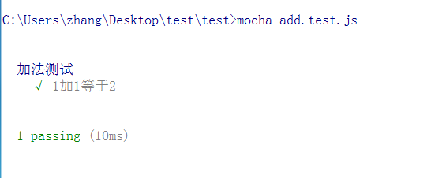
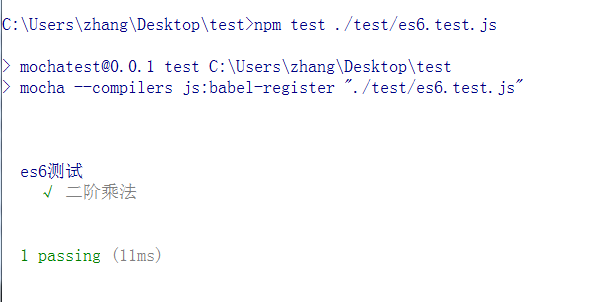

# Mocha安装

以搭建一个mochaTest项目为例子，首先我们创建一个mochaTest目录

## 步骤1

在mocchaTest目录下，运行

```shell
npm init # 初始化项目
npm install mocha --save-dev # 将mocha保存到package.json里面
```

## 步骤2

搭建一个简单的项目目录结构，一般来说，我们可以将我们所编写的代码放置在src中，然后将测试的代码放置在test目录下，并且按照一定的命名可以清晰地对应测试代码和所被测试代码之间的关系。

--mochaTest

    -- src
        -- add.js
    -- test
        -- add.test.js
    -- package.json

## 步骤3

编写add.js，我们实现一个简单的两数相加的功能

```javascript
function add(a, b){
    return (a+b);
}

module.exports = add;
```

## 步骤4 

测试add模块，即

```javascript
var add = require("../src/add"); // 引入add模块
var assert = require("assert"); // 引入内置的assert模块

describe("加分函数的测试", function() {
    it("1加1等于2", function(){
        assert.equal(2, add(1, 1));
    });
});
```

describe开始一个测试，被称为一个`测试套件(test suite)`，表示一组相关的测试。
it表示一个单独的测试，是测试的最小的单位，称为`测试用例(test case)`。

## 步骤5

运行之后，就可以看到测试的效果

```shell
mocha add.test.js
```



## 使用es6

由于我们都是在开发环境下进行测试，因此可以在使用mocha进行测试的，大胆地使用一些es6的语法，下面就来看看如何同时使用mocha和babel来进行测试脚本的编写。

### 1. 安装babel-register

```shell
npm install --save-dev babel-register
```

### 2. 配置package.json

```javascript
"scripts" : {
    "test" : "mocha --compilers js:babel-register"
}
```

### 3. 示例

--mochaTest

    -- src
        -- add.js
    -- test
        -- es6.test.js
    -- package.json

es6.test.js的内容为

```javascript
var assert = require("assert");

describe("es6测试", function(){
    it("二阶乘法", function(){
        assert(1, (x => x*x)(1));
    });
})
```

*注意，这里并不需要加上require("babel-register")*

运行结果为：

