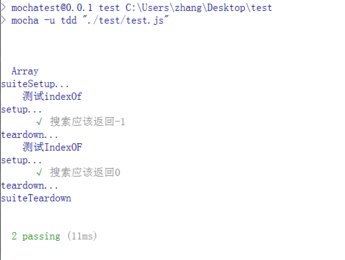
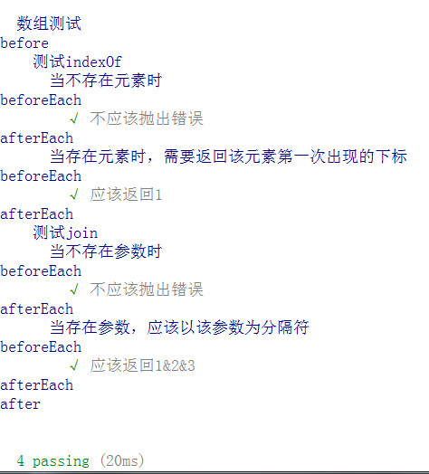
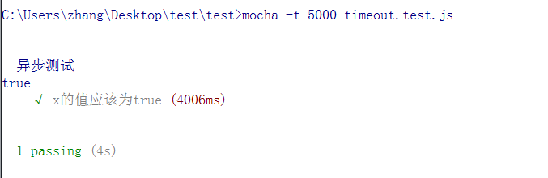
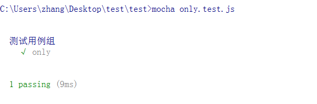
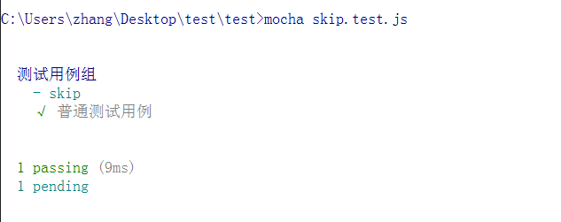
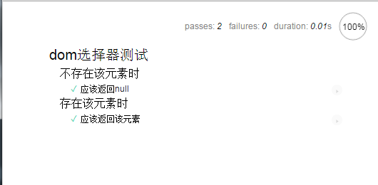

# 测试与mocha入门简介

## 1. 测试的概念

### 1.1 单元测试

单元测试（unit testing），是指对软件中的最小可测试单元进行检查和验证。

* 在一些传统的结构化编程语言中，例如C，要进行测试的单元一般是函数或子过程。
* 在面向对象的语言中，要进行测试基本单元是类。

### 1.2 断言

断言表示一些布尔表达式，在编写代码的时候，我们总是会作出一些假设，断言就是用于代码中捕捉这些假设。

在单元测试中，我们经常使用断言来验证我们的代码是否正常运行。

断言可以有两种形式

1. assert Expresstion1
2. assert Expresstion1:Expresstion2

其中Expression1应该总是一个布尔值，Expression2是断言失败时，输出的失败消息的字符串。

### 1.3 TDD

测试驱动开发是敏捷开发中的一项核心实践和技术，也是一种设计方法论。TDD的原理是在开发功能代码之前，先编写单元测试用例代码，测试代码确定需要编写什么产品代码。TDD的基本思路就是通过测试来推动整个开发的进行，但测试驱动开发并不只是单纯的测试工作，而是把需求分析，设计，质量控制量化的过程。TDD首先考虑使用需求（对象、功能、过程、接口等），主要是编写测试用例框架对功能的过程和接口进行设计，而测试框架可以持续进行验证。

### 1.4 BDD

行为驱动开发是一种敏捷软件开发的技术，它鼓励软件项目中的开发者、QA和非技术人员或商业参与者之间的协作。主要是从用户的需求出发，强调系统行为。BDD最初是由Dan North在2003年命名，它包括验收测试和客户测试驱动等的极限编程的实践，作为对测试驱动开发的回应。

## 2. mocha简介

Mocha.js是被广泛使用的Javascript测试框架，在浏览器和Node环境都可以使用。Mocha提供TDD和BDD的测试接口。

Mocha提供了

* 断言单元测试，可以进行功能性测试
* 同步代码测试
* 异步代码测试

### 2.1 断言

在Mocha中运行你使用任何断言库来进行代码的测试，其中有

|库|描述|
|:--|:--|
|should.js|BDD风格的测试接口|
|expect.js|expect()风格的断言|
|chai|提供expect(),assert()和should这几种风格的断言|
|better-assert|C语言风格的断言|
|unexpected|BDD断言的扩展|

当然，我们可以用Nodejs内建的`assert`模块来进行断言。

```javascript
describe("测试数组", function(){
    it("测试indexOf()", function(){
        assert.equal(-1, [1,2,3].indexOf(4));
    });
});
```

### 2.2 TDD测试接口

TDD测试风格的接口：

* suite: 定义一组测试用例（也可以是一个，可以嵌套）
* suiteSetup: 此方法会在这个suite所有测试用例执行前，执行有且只有一次。
* setup: 此方法会在每个测试用例执行前都执行一遍。
* test: 具体执行的测试用例实现代码。
* teardown: 此方法会在这个suite所有测试用例执行后都执行一次，与setup相反
* suiteTeardown: 此方法会在这个suite所有测试用例执行后执行一次，与suiteTeardown相反。

```javascript
var mocha = require("mocha");
var assert = require("assert");

var suite = mocha.suite;
var suiteSetup = mocha.suiteSetup;
var setup = mocha.setup;
var test = mocha.test;
var teardown = mocha.teardown;
var suiteTeardown = mocha.suiteTeardown;

// 一组测试用例
suite("Array", function(){
    suiteSetup(function(){
        console.log("suiteSetup...");
    });

    setup(function(){
        console.log("setup...");
    });

    suite("测试indexOf", function(){
        test("搜索应该返回-1", function(){
            assert(-1, [1,2,3].indexOf(4));
        });
    });

    suite("测试IndexOF", function(){
        test("搜索应该返回0", function(){
            assert(1, [1,2,3].indexOf(1));
        });
    })

    teardown(function(){
        console.log("teardown...");
    });

    suiteTeardown(function(){
        console.log("suiteTeardown");
    });
});
```



要运行这段代码，需要注意的是mocha默认的是BDD模式，因此，需要切换成TDD模式才可以运行。本人通过在package.json配置`scripts`字段，来简化自己的命令

```javascript
"scripts" : {
    "test" : "mocha -u tdd"
}
```

此时只需要在运行

```shell
npm test ./test/test.js 
```

*如果直接运行mocha -u tdd是不行的，暂时不知道为什么。*

### 2.3 BDD测试接口

BDD测试风格的接口

* describe(): 描述场景，在里面可以设定Context，可包括多个测试用例，也可以嵌套场景
* it(): 位于场景内，描述测试用例
* before(): 所有测试用例的统一前置动作
* after(): 所有测试用例的统一后置动作
* beforeEach(): 每个测试用例的前置动作
* aferEach(): 每个测试用例的后置动作

```javascript
var assert = require("assert");
var should = require("should");

describe("数组测试", () => {
	before(() => {
        console.log("before");
    });

    beforeEach(() => {
        console.log("beforeEach");
    });

    describe("测试indexOf", () => {
        context("当不存在元素时", () => {
            it("不应该抛出错误", () => {
                (() => {
                    [1,2,3].indexOf(4);
                }).should.not.throw();
            })
        });
        context("当存在元素时，需要返回该元素第一次出现的下标", () => {
            it("应该返回1", () => {
                [1,2,3].indexOf(1).should.equal(0)
            })
        });
    });

    describe("测试join", () => {
        context("当不存在参数时", () => {
            it("不应该抛出错误", () => {
                (() => {
                    [1,2,3].join();
                }).should.not.throw();
            })
        });
        context("当存在参数，应该以该参数为分隔符", () => {
            it("应该返回1&2&3", () => {
                [1,2,3].join("&").should.equal("1&2&3")
            })
        });
    });
    
    after(() => {
        console.log("after");
    });

    afterEach(() => {
        console.log("afterEach");
    });

});
```

注意，在运行本代码的时候，需要先安装

```shell
npm install should --save-dev
```

并且注意在本例子中使用了es6的语法，在[上一章节](./installation.md)有说明如何安装。

运行结果如下：



## Mocha支持的特性

### 1. 异步测试

Mocha默认每个测试用例最多2000ms，如果到时没有得到结果，就会报错，对于涉及异步操作的测试用例，我们需要用-t或--timeout参数指定超时门槛。

```javascript
var assert = require("assert");

describe("异步测试", () => {
    it("x的值应该为true", (done) => {
        var x = false;
        setTimeout(() => {
            x = true;
            console.log(x);
            assert.equal(true, x);
            done(); // 通知mocha测试结束
        },4000);
    })
})
```

运行结果如下：



注意需要在it块执行的时候，会传入一个done参数，当测试结束的时候，必须显示调用这个函数，通知Mocha测试结束了。


### 2. 测试用例管理

在大型项目中，会有很多的测试用例，我们可以通过几个方法来进行管理

* only: 表示只运行某个测试套件或测试用例
* skip: 表示跳过指定的测试套件或测试用例

```javascript
var assert = require("assert");

describe("测试用例组", () => {
    it.only("only", () => {
        assert.equal(1, 1);
    });

    it("普通测试用例", () => {
        assert(1,1);
    });
})
```



```javascript
var assert = require("assert");

describe("测试用例组", () => {
    it.skip("skip", () => {
        assert.equal(1, 1);
    });

    it("普通测试用例", () => {
        assert(1,1);
    });
})
```



### 3. 浏览器端测试

除了在命令行运行， Mocha还可以在浏览器端运行

1、首先，使用mocha init命令在指定的目录下生成初始化文件

```shell
mocha init
```

此时可以看到目录下生成了几个文件，结构如下

-- browser

    -- index.html
    -- mocha.css
    -- mocha.js
    -- tests.js

看到这里，我们就明白了。实际上就是将我们的代码和mocha.js一起引入到页面中，在浏览器的环境下打开，这样就可以在测试我们的客户端js代码（改变了宿主环境）。我对这样的一个文件进行调整，使其更加符合开发时的需求，即目录结构为：

-- brower

    -- test.html
    -- css
        -- mocha.css
        -- style.css 有时候可能要测试一些操作样式的代码
    -- lib
        -- mocha.js 
        -- jquery.js 一些常用的库文件
    -- script
        -- domSelector.js 实现的一个小模块
    -- test
        -- domSelector.test.js 小模块的测试代码

我们只要在生成的html文件中，修改一下引入文件的路径即可

```html
<!DOCTYPE html>
<html>
  <head>
    <title>Mocha</title>
    <meta http-equiv="Content-Type" content="text/html; charset=UTF-8">
    <meta name="viewport" content="width=device-width, initial-scale=1.0">
    <link rel="stylesheet" href="mocha.css" />
  </head>
  <body>
    <div id="mocha"></div>
    <script src="lib/mocha.js"></script>
    <script src="lib/chai.js"></script>
    <script>mocha.setup('bdd');</script>
    <script src="script/domSelector.js"></script>
    <script src="test/domSelector.test.js"></script>
    <script>
      mocha.run();
    </script>
  </body>
</html>
```

由于不在Node环境下了，就不能使用内置的assert断言库了，我们引进chai断言库来做替代。

我们对`document.getElementById()`为例，做一个测试，编辑domSelector.test.js文件

```javascript
var expect = chai.expect;
describe("dom选择器测试", function(){

    context("不存在该元素时", function() {
        it("应该返回null", function(){
            expect(document.getElementById("1")).to.be.equal(null);
        });
    });

    context("存在该元素时", function() {
        it("应该返回该元素", function(){
            expect(document.getElementById("mocha").id).to.be.equal("mocha");
        });
    });

});
```

运行结果如下



我们来一步步思考如何进行前端页面代码的测试。

1. 首先我们编写我们的前端页面，js代码。
2. 我们对页面注入mocha.js和chai.js和js代码的测试代码，这一步其实可以使用构建工具来完成。【已有的构建工具可以做到】
3. 在浏览器中运行该页面，然后显示，显示可以变成一行，置顶在页面之上，这样尽量不会影响其他的。【暂时未知】

在日后的实践会跟进这个想法，看是否可以有一个工具来实现。

## 参考

1. [测试框架 Mocha 实例教程](http://www.ruanyifeng.com/blog/2015/12/a-mocha-tutorial-of-examples.html)
2. [测试驱动开发(TDD)及测试框架Mocha.js入门学习](http://www.mamicode.com/info-detail-852916.html)
3. [mochajs](http://mochajs.org/)