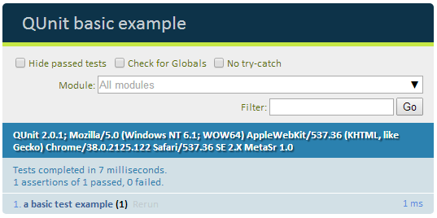
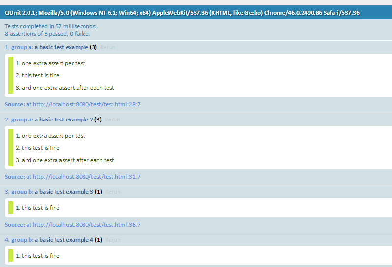

# QUnit Cookbook

## 1. 自动化单元测试

### 1.1 问题

当你想自动化测试自己的应用和框架，从TDD的开发模式中受益。此时你需要一个测试框架，你可能会想自己去编写这样一个东西，但是一个测试框架需要考虑非常多的细节，满足在不同浏览器之间测试js代码的需求，工作量非常大。

### 1.2 解决

此时，你需要QUnit，这个是jQuery的测试框架，并且也被广泛地应用在其他的项目上。

使用QUnit非常简单，只需要在html文件引入两个文件即可

* qunit.js
* qunit.css

```html
<!DOCTYPE html>
<html>
<head>
  <meta charset="utf-8">
  <title>QUnit basic example</title>
  <link rel="stylesheet" href="https://code.jquery.com/qunit/qunit-2.0.1.css">
</head>
<body>
  <div id="qunit"></div>
  <div id="qunit-fixture"></div>
  <script src="https://code.jquery.com/qunit/qunit-2.0.1.js"></script>
  <script>
    QUnit.test( "a basic test example", function( assert ) {
      var value = "hello";
      assert.equal( value, "hello", "We expect value to be hello" );
    });
  </script>
</body>
</html>
```



我们只需要在\<body\>添加两个div块即可，即id为`qunit`和`qunit-fixture`，它们的作用是展示测试结果信息，例如是否通过，错误信息等等。

此外，页面还提供了其他的选项信息

* 提供用户代理信息，方便展示在不同浏览器测试的结果
* 选框`Hide passed Tests`可以隐藏掉通过的测试，让我们可以专注于失败的测试，在页面运行很多的测试的时候，非常有用。
* `Check for Globals`会让QUnit对window对象下的所有属性列一个清单，然后在测试前后进行对比，当添加或者删除全局属性时，测试就会失败。这个选项是为了保证测试代码不会意外地添加任何的全局属性。
* `No try-catch`选项QUnit不会运行try-catch代码块，如果你的测试抛出异常，就无法继续进行测试【？？】

## 2. 断言

断言是单元测试一个必要的元素。QUnit提供了一些断言的[API](https://api.qunitjs.com/category/assert/)。下面介绍三个简单的断言API。

### ok(truthy[,message])

这个方法只要求一个参数，当这个参数执行结果为true时，测试成功，否则测试失败。

```javascript
QUnit.test("ok test", function( assert ){
  assert.ok( true, "true succeeds" );
  assert.ok( "non-empty", "non-empty string succeeds" );
  assert.ok( false, "false fails" );
  assert.ok( 0, "0 fails" );
  assert.ok( NaN, "NaN fails" );
  assert.ok( "", "empty string fails" );
  assert.ok( null, "null fails" );
  assert.ok( undefined, "undefined fails" );
});
```

### equal(actual, expected[,message])

这里的相等，相当于js运算符中的`==`，它会比较actual和expected的值，当它们相等时，测试通过，否则测试失败。当失败时，actual和expected的值都会被展示到页面信息中。

```javascript
QUnit.test( "equal test", function( assert ) {
  assert.equal( 0, 0, "Zero, Zero; equal succeeds" );
  assert.equal( "", 0, "Empty, Zero; equal succeeds" );
  assert.equal( "", "", "Empty, Empty; equal succeeds" );
  assert.equal( 0, false, "Zero, false; equal succeeds" );
 
  assert.equal( "three", 3, "Three, 3; equal fails" );
  assert.equal( null, false, "null, false; equal fails" );
});
```

*如果需要严格相等，则可以使用strictEqual()*

### deepEqual(actual, expected[,message])

这个方法跟equal类似，但是它可以进行Object类型的比较，例如正则表达式，数组，函数等

```javascript
QUnit.test( "deepEqual test", function( assert ) {
  var obj = { foo: "bar" };
 
  assert.deepEqual( obj, { foo: "bar" }, "Two objects can be the same in value" );
});
```

## 3. 同步回调

在js中，经常会有回调函数，在回调函数中的断言可能不会被马上执行（需要触发条件），QUnit提供了`assert.expect()`来指定断言测试的个数，且会等待代码中的指定个数的断言测试都执行之后，再返回测试结果。

```javascript
QUnit.test( "a test", function( assert ) {
  assert.expect( 2 ); // 放在测试开始的地方
 
  function calc( x, operation ) {
    return operation( x );
  }
 
  var result = calc( 2, function( x ) {
    assert.ok( true, "calc() calls operation function" );
    return x * x;
  });
 
  assert.equal( result, 4, "2 square equals 4" );
});
```

## 4. 异步回调

QUnit提供`assert.async()`来进行异步回调的测试，这个方法会返回一个`done()`，当我们所有的操作结束之后调用它，通知QUnit测试已经结束，这样测试才会返回结果。

```javascript
QUnit.test( "asynchronous test: async input focus", function( assert ) {
  var done = assert.async();
  var input = $( "#test-input" ).focus();
  setTimeout(function() {
    assert.equal( document.activeElement, input[0], "Input was focused" );
    done();
  });
});
```

## 5. 测试用户行为

测试用户的交互行为，可以在代码中触发相对应的事件，来达到自动化的测试，而不需要真正用户的介入。

```javascript
QUnit.test( "a test", function( assert ) {
  assert.expect( 1 );
 
  var $body = $( "body" );
 
  $body.on( "click", function() {
    assert.ok( true, "body was clicked!" );
  });
 
  $body.trigger( "click" );
});
```

## 6. 保持测试的原子性

```javascript
QUnit.test( "2 asserts", function( assert ) {
  var fixture = $( "#qunit-fixture" );
 
  fixture.append( "<div>hello!</div>" );
  assert.equal( $( "div", fixture ).length, 1, "div added successfully!" );
 
  fixture.append( "<span>hello!</span>" );
  assert.equal( $( "span", fixture ).length, 1, "span added successfully!" );
});
```

这段代码可以改成

```javascript
QUnit.test( "Appends a div", function( assert ) {
  var fixture = $( "#qunit-fixture" );
 
  fixture.append( "<div>hello!</div>" );
  assert.equal( $( "div", fixture ).length, 1, "div added successfully!" );
});
 
QUnit.test( "Appends a span", function( assert ) {
  var fixture = $( "#qunit-fixture" );
 
  fixture.append("<span>hello!</span>" );
  assert.equal( $( "span", fixture ).length, 1, "span added successfully!" );
});
```

因为QUnit的test方法在进行测试之后，会清理掉测试代码生成的东西，避免对下一个测试产生影响。例如在上面的测试代码中会生成两个dom节点div和span，在测试结束之后，会将这两个dom节点删除掉。

## 7. 组测试

我们可以对测试用例进行分组，使用`QUnit.module()`，还可以在这个方法中定义在测试中一下公共使用的方法。

```javascript
QUnit.module( "group a", {
    beforeEach: function( assert ) {
    assert.ok( true, "one extra assert per test" );
  }, afterEach: function( assert ) {
    assert.ok( true, "and one extra assert after each test" );
  }
});
QUnit.test( "a basic test example", function( assert ) {
  assert.ok( true, "this test is fine" );
});
QUnit.test( "a basic test example 2", function( assert ) {
  assert.ok( true, "this test is fine" );
});
 
QUnit.module( "group b" );
QUnit.test( "a basic test example 3", function( assert ) {
  assert.ok( true, "this test is fine" );
});
QUnit.test( "a basic test example 4", function( assert ) {
  assert.ok( true, "this test is fine" );
});
```

运行结果为



## 7. 自定义断言

我们可以通过

```javascript
QUnit.assert.myAssertion = myAssertion;
QUnit.extend(QUnit.assert, {myAssertion : myAssertion});
```

这两种方式来自定义断言，这一可以提高代码的可读性和简洁性，例如：

```javascript
QUnit.test( "retrieving object keys", function( assert ) {
  var objectKeys = keys( { a: 1, b: 2 } );
  assert.ok( objectKeys.indexOf("a") > -1, "Object keys" );
  assert.ok( objectKeys.indexOf("b") > -1, "Object keys" );
 
  var arrayKeys = keys( [1, 2] );
  assert.ok( arrayKeys.indexOf("1") > -1, "Array keys" );
  assert.ok( arrayKeys.indexOf("2") > -1, "Array keys" );
});
```

上面一个测试里面都是重复的，那么我们就就可以通过自定义断言的方式来改善我们的代码

```javascript
QUnit.assert.contains = function( needle, haystack, message ) {
  var actual = haystack.indexOf(needle) > -1;
  this.push(actual, actual, needle, message);
};
QUnit.test("retrieving object keys", function( assert ) {
  var objectKeys = keys( { a: 1, b: 2 } );
  assert.contains( "a", objectKeys, "Object keys" );
  assert.contains( "b", objectKeys, "Object keys" );
 
  var arrayKeys = keys( [1, 2] );
  assert.contains( "1", arrayKeys, "Array keys" );
  assert.contains( "2", arrayKeys, "Array keys" );
});
```

## 原文

[QUnit Cookbook](http://qunitjs.com/cookbook/)