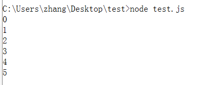

# 协程

要理解generator就必须知道一个概念，那就是`协程`。

## 1. 基本概念

协程，又成为微线程（coroutine）。

**进程(process) vs 线程(thread)**

我们都知道在操作系统级别上有两个重要的概念(也是实体):进程(process)和线程(thread)，这两个东西是用于操作系统模拟`并行`的，在单个CPU上，os通过调度算法，让CPU轮流执行线程或者进程，来达到程序的并发执行。

那么协程又是什么？首先要明确的是，协程是编译器级别的，而并非线程和进程一样是操作系统级别的。协程的实现，通过是对某个语言做相应的提议，然后通过后成编译器标准，然后编译厂商来实现该机制。

## 2. 作用

协程的作用是什么？

简单来说，就是实现函数的分段式执行。就是一个函数的执行可以主动放弃CPU的控制权，先挂起，让其他的函数先执行，然后在返回，从上次执行结束的地方继续执行。

这样看起来很像是多线程轮流执行。但是却有着很大的区别：协程是`一个线程执行`。

* 因为是一个线程执行，所以不存在线程的切换，而是由程序自身控制，也就不存在所谓的线程切换的开销。
* 不需要多线程的锁机制。因为只有一个线程，也就不存在同时写变量的冲突。在协程中控制共享资源不加锁，只需要判断状态就好了。这也说明协程的执行效率很高一些。

举个`生产者消费者模型基于抢占式多线程编程`的实现（伪代码）

```javascript
// 资源，队列容器
var q = [];

// 消费者进程
loop(); // 循环等待
lock(q); // 加锁
var item = getResourceFrom(q); // 获取资源
unlock(q); // 操作结束，资源解锁
operatingResource(item);
sleep;

// 生成者线程
loop(); // 循环等待
var item = createResource(p); // 生产资源
lock(q); // 加锁
q.push(item); // 写入资源
unlock(q); // 解锁
```

可以看到，以上的代码中有两个特点

1. 对资源操作需要进行加锁和解锁的操作。（保证线程安全）
2. 消费者线程必须通过sleep，让出CPU，用于执行生产者线程使用。

那么如果是协程的编程模式，就简单地多。

```javascript
var q = [];
var count = 0;

// 消费者
function *consumer() {
    while (true){
       var item = yield producer();
       console.log(item); 
    }
}

// 生产者
function producer() {
    q.push(count++);
}

function main () {
    const consumerGen = consumer();
    // 我们可以通过代码来控制其交替执行

    // 执行到获取item之前，放弃执行权，先执行producer(),
    consumerGen.next();
    // 之后可以获取item，然后再放弃执行权，执行producer，一直循环
    consumerGen.next(q.shift());
    consumerGen.next(q.shift());
    consumerGen.next(q.shift());
    consumerGen.next(q.shift());
    consumerGen.next(q.shift());
    consumerGen.next(q.shift());
}

main();
```

执行效果如下：




TBD...)-


## 参考

1. [协程-廖雪峰](http://www.liaoxuefeng.com/wiki/001374738125095c955c1e6d8bb493182103fac9270762a000/0013868328689835ecd883d910145dfa8227b539725e5ed000)
2. [C++ 协程与网络编程](http://www.cppblog.com/ioriiod0/archive/2013/01/01/196890.html)
3. [谈谈协程和C语言的协程](http://www.yeolar.com/note/2013/02/17/coroutines/)
4. [协程（Coroutine）并不是真正的多线程](http://www.cnblogs.com/wonderKK/p/4062591.html)
5. [协程（一）原理](http://www.cnblogs.com/takeaction/archive/2015/03/25/4365422.html)