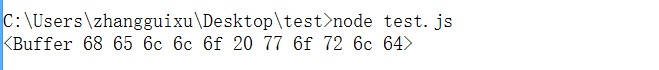

# Thunk

## 1. 诞生背景

Thunk函数的诞生是源于一个编译器设计的问题：`求值策略`，即函数的参数到底应该何时求值。

例如：

```javascript
var x = 1;
function f(m) {
    return m * 2;
}
f(x + 5);
```

其中`x+5`这个表达式应该什么时候求值，有两种思路

* 传值调用(call by value)，即在进入函数体之间，先计算x+5的值，再将这个值（6）传入函数f，例如c语言，这种做法的好处是实现比较简单，但是有可能会造成性能损失。
* 传名调用(call by name)，即直接将表达式(x+5)传入函数体，只在用到它的时候求值。

## 2. Thunk函数的含义

编译器的`传名调用`实现，往往就是将参数放到一个临时函数之中，再将这个临时函数转入函数体，这个临时函数就叫做`Thunk函数`。

来看一段代码示例：

```javascript
function f(m) {
    return m*2;
}

f(x + 5);

// 等价于以下代码
var thunk = function () {
    return x + 5;
};

function f(thunk) {
    return thunk() * 2;
}
```

## 3. javascript中的Thunk函数

我们都知道Javascript是传值调用的，那么js中的Thunk函数又是怎么回事？

在Javascript语言中，Thunk函数替换的不是表达式，而是多参数函数，将其替换成单参数的版本，且只接受回调函数作为参数。

还是通过代码来理解，即

```javascript
// 正常版本的readFile，需要两个参数filename、callback
fs.readFile(fileName, callback);

// thunk版本的readFile
var readFileThunk = thunkify(fs.readFile);
readFileThunk(fileName)(callback);
```

*原文中例子就是柯里化，预置参数fileName，直接调用fs.readFile*

好，现在我们来思考如何实现`thunkify`函数。我们从调用的形式来看，返回的应该是一个高阶函数，即返回一个函数a，a的返回还是一个函数。

```javascript
var thunkify = function (fn) {
    return function () {
        return function () {

        }
    }
};
```

结合上述例子，因为是包装函数，因此最终还是readFile执行，且需要fileName，因此：

```javascript
var thunkify = function (fn) {
    return function () {
        var args = Array.prototype.slice.call(arguments);
        return function (callback) {
            args.push(callback);
            return fn.apply(this, args);
        }
    }
};
```

这样似乎很完美，我们运行整个示例

```javascript
const fs = require('fs');

var thunkify = function (fn) {
    return function () {
        var args = Array.prototype.slice.call(arguments);
        return function (callback) {
            args.push(callback);
            return fn.apply(this, args);
        }
    }
};

var readFileThunk = thunkify(fs.readFile);
readFileThunk('test.txt', 'utf-8')( (err, data) => {
	console.log(data);
});
```

运行结果为



## 4. 打造thunkify模块

要写出一个健壮的`thunkify`函数，需要考虑的各种情况，而我们通过tj大神写的[thunkify模块](https://github.com/tj/node-thunkify/blob/master/test/index.js)的测试代码，来看看我们自己的`thunkify`还存在哪些不足，一步步来优化。

1、保存上下文的问题

```javascript
function load(fn) {
  fn(null, this.name);
}

var user = {
  name: 'tobi',
  load: thunkify(load)
};

user.load()((err, res) => {
	console.log(res);
});
```

运行之后，res的结果为`undefined`，原因是没有保存上下文，改进一下

```javascript
var thunkify = function (fn) {
    return function () {
        var args = Array.prototype.slice.call(arguments);
        var ctx = this;
        return function (callback) {
            args.push(callback);
            return fn.apply(ctx, args);
        }
    }
};
```

2、捕抓错误

```javascript
function load(fn) {
  throw new Error('boom');
}
load = thunkify(load);
load()(err => console.log(err.message));
```

运行之后，发现并没有捕抓到错误，我们需要执行函数进行try/catch，并且当出错时，传递出错信息。

```javascript
var thunkify = function (fn) {
    return function () {
        var args = Array.prototype.slice.call(arguments);
        var ctx = this;
        return function (callback) {
            args.push(callback);
            var result;
            // try/catch捕抓信息，并且出错时，传递给回调函数
            try {
            	result = fn.apply(ctx, args);
            } catch (e) {
            	callback(e);
            }
            return result;
        }
    }
};
```

3、回调函数应该只调用一次。

```javascript
function load(fn) {
  fn(null, 1);
  fn(null, 2);
  fn(null, 3);
}

load = thunkify(load);

load()((err,ret) => console.log(ret));
```

运行输出结果为`1 2 3`，而我们期望结果只为`1`，那么需要判断callback是否已经执行过了，使其只执行一次。

```javascript
var thunkify = function (fn) {
    return function () {
        var args = Array.prototype.slice.call(arguments);
        var ctx = this;
        return function (callback) {
        	var called; 
            // 对callback进行封装，使其只能执行一次。
            args.push(function () {
            	if(called) return;
            	called = true;
            	callback.apply(null, arguments);
            });
            var result;
            try {
            	result = fn.apply(ctx, args);
            } catch (e) {
            	callback(e);
            }
            return result;
        }
    }
};
```

到这里，我们通过了所有的测试，完成了一个`健壮`的`thunkify`模块。

## 来源

1. [Thunk-阮一峰](http://www.ruanyifeng.com/blog/2015/05/thunk.html)
2. [thunkify-tj](https://github.com/tj/node-thunkify)