# Promise

## 1. 概述

在Promise之前，在js中的异步编程都是采用回调函数和事件的方式，但是这种编程方式在处理复杂业务的情况下，很容易出现`callback hell(回调地狱)`，使得代码很难被理解和维护。

Promise就是改善这种情形的异步编程的解决方案，它由社区最早提出和实现，es6将其写进了语言标准，统一了用法，并且提供了一个原生的对象`Promise`。

## 2. 理解Promise

我们通过一个简单例子先来感受一下Promise。

```javascript
var p = new Promise(function (resolve, reject) {
    // ...
    if(/* 异步操作成功 */){
        resolve(ret);
    } else {
        reject(error);
    }
});

p.then(function (value) {
    // 完成态
}, function (error) {
    // 失败态
});
```

我们需要关注的是

* Promise的构造函数
* resolve() ， reject()
* then()

### 2.1 Promise构造函数

我们在通过Promise构造函数实例化一个对象时，会传递一个函数作为参数，那么这个函数有什么特点？

答案就是在新建一个Promise后，这个函数会立即执行。

```javascript
let promise = new Promise(function (reslove, reject) {
    console.log('Promise');
});

console.log('end');
```

执行结果如下：

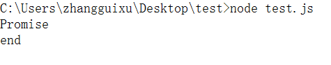

可以看到是先输出了`Promise`，再输出了`end`。

### 2.2 resolve/reject

在Promise中，对一个异步操作做出了抽象的定义，Promise操作只会处在3种状态的一种，他们之间的转化如图所示

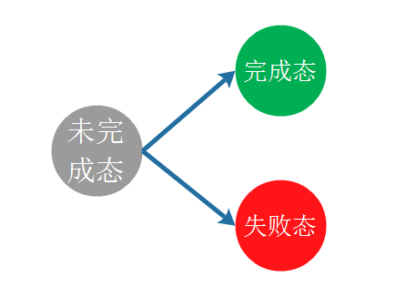

注意，这种状态的改变只会出现从未完成态向完成态或失败态转化，不能逆反。完成态和失败态不能互相转化，而且，状态一旦转化，将不能更改。

只有异步操作的结果可以决定当前是哪一种状态，任何其他操作都无法改变这个状态。这也是Promise这个名字的由来，它的英语意思是承诺，表示其他手段无法改变。

在声明一个Promise对象实例时，我们传入的匿名函数参数中：

* `resolve`就对应着完成态之后的操作
* `reject`对应着失败态之后的操作

### 2.3 then()

那么问题来了，then()方法有什么作用？resolve和reject又是从哪里传递过来的？

其实这两个问题是一个问题，在实例化一个Promise对象之后，我们调用该对象实例的`then()`方法传递的两个参数中:

* 第一个参数（函数）对应着完成态的操作，也就是`resolve`
* 第二个参数（函数）对应着失败态的操作，也就是`reject`

那就是说，在Promise中是通过then()方法来指定处理异步操作结果的方法。

### 2.4 实际案例

到这里我们明白了Promise的语法，也了解了Promise中函数是如何执行的，结合一个实际的案例，来加深对Promise的理解。

我们来实现一个异步加载图片的函数

```javascript
function loadImageAsync(url) {
    return new Promise(function (reslove, reject) {
        var img = new Image();
        img.onload = function () {
            reslove();
        }
        img.onerror = function () {
            reject();
        }
        console.log("loading image");
        img.src = url;
    });
}
var loadImage1 = loadImageAsync("https://www.google.co.jp/images/branding/googlelogo/2x/googlelogo_color_272x92dp.png");
loadImage1.then(function success() {
    console.log("success");
}, function fail() {
    console.log("fail");
});

var loadImage2 = loadImageAsync("1.png");
loadImage2.then(function success() {
    console.log("success");
}, function fail() {
    console.log("fail");
});
```

我们在chrome中执行，先是传递一个有效的url，再传递一个无效的url，执行的效果为：

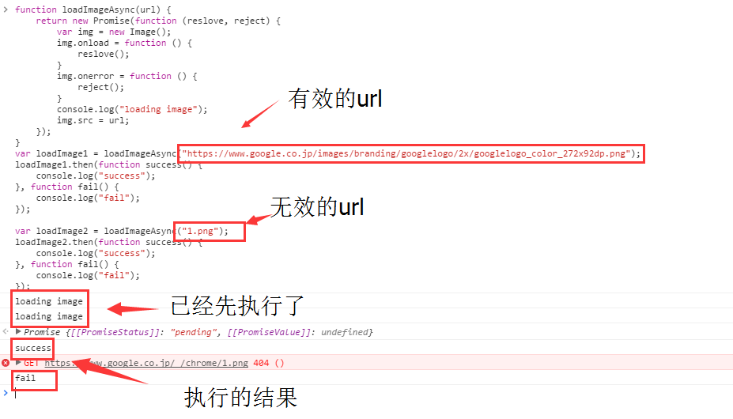

## 3. Promise进阶

### 3.1 resolve/reject的参数

`reject`函数的参数一般来说是Error对象的实例，而`resolve`函数的参数除了正常的值外，还可能是另一个`Promise实例`，表示异步操作的结果有可能是一个值，也有可能是另一个异步操作。

```javascript
var p1 = new Promise( function(resolve, reject) {
    // ...
});

var p2 = new Promise( function(resolve, reject) {
    // ...
    resolve(p1);
});
```

代码分析：p1和p2都是Promise的实例，p2中的resolve方法将p1作为参数，即一个异步操作的结果是返回另一个异步操作。

注意，这时p1的状态就会传递给p2，也就是说，p1的状态决定了p2的状态，他们之间的关系是

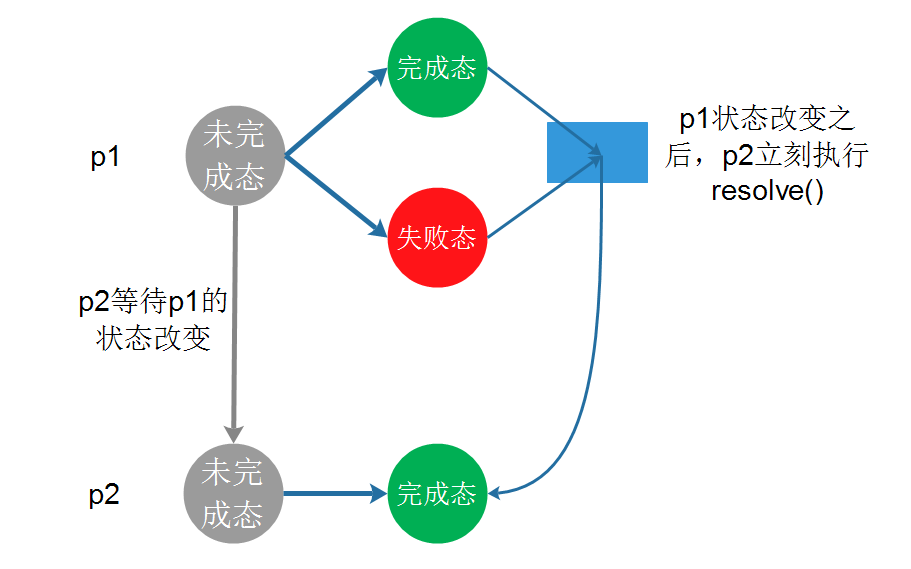

举个例子

```javascript
console.time('Promise example start')
var p1 = new Promise( (resolve, reject) => {
    setTimeout(() => resolve('hi'), 3000);
});

var p2 = new Promise( (resolve, reject) => {
    setTimeout(() => resolve(p1), 10);
});

p2.then( ret => {
    console.log(ret);
    console.timeEnd('Promise example end')
});
```

我们在node环境下运行以上代码，执行结果为：

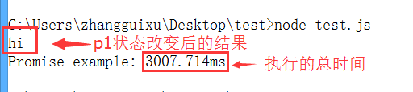

从执行时间可以看到，p2会等待p1的执行结果，然后再执行，从输出hi可以看到p1完成状态转变之后，传递给resolve(或者reject)的结果会传递给p2中的`resolve`。

### 3.2 then()

从上面的例子，我们可以了解到then()方法是Promise实例的方法，即`Promise.prototype`上的，它的作用是为Promise实例添加状态改变时的回调函数，这个方法的第一个参数是`resolved`状态的回调函数，第二个参数（可选）是`rejected`状态的回调函数。

那么then()方法的返回值是什么？`then`方法会返回一个新的Promise实例（注意，不是原来那个Promise，原来那个Promise已经承诺过，此时继续then就需要新的承诺~~），这样的设计的好处就是可以使用链式写法。

还有一个点，就是链式中的`then`方法（第二个开始），它们的`resolve`中的参数是什么？答案就是前一个then()中resolve的`return`语句的返回值。

来一个示例：

```javascript
var p1 = new Promise( (resolve, reject) => {
    setTimeout(() => resolve('p1'), 10);
});

p1.then( ret => {
    console.log(ret);
    return 'then1';
}).then( ret => {
    console.log(ret);
    return 'then2';
}).then( ret => {
    console.log(ret);
});
```

在node环境下执行，执行结果为：

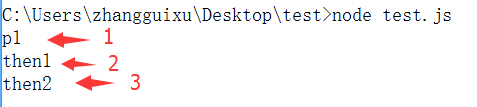

### 3.3 catch()错误处理

catch()方法是Promise实例的方法，即`Promise.prototype`上的属性，它其实是`.then(null, rejection)`的简写，用于指定发生错误时的回调。

这个方法其实很简单，在这里并不想讨论它的使用，而是想讨论的是Promise中的错误的捕抓和处理。

#### 3.3.1 Error对象的传递性

Promise对象的Error对象具有`冒泡`性质，会一直向后传递，直到被捕获为止。也就是说，错误总是会被下一个catch语句捕获，示例代码如下：

```javascript
var p = new Promise( (resolve, reject) => {
    setTimeout(() => resolve('p1'), 10);
});

p.then( ret => {
    console.log(ret);
    throw new Error('then1');
    return 'then1';
}).then( ret => {
    console.log(ret);
    throw new Error('then2');
    return 'then2';
}).catch( err => {
    // 可以捕抓到前面的出现的错误。
    console.log(err.toString());
});
```

执行结果如下

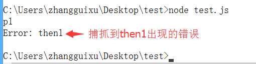

在第一个then中抛出了一个错误，在最后一个Promise对象中可以catch到这个错误。

*因为有这种方便的错误处理机制，所以一般来说不要在then方法里面定义reject状态的回调函数， 而是使用catch方法*

#### 3.3.2 vs try/catch

> 跟传统的`try/catch`不同的是，如果没有使用`catch`方法指定错误处理回调函数，则Promise对象抛出的错误不会传递到外层代码（在chrome会报错）

Node.js有一个unhandledRejection事件，专门监听未捕获的reject错误。以下代码就是在node环境下运行。

```javascript
var p = new Promise((resolve, reject) => {
    resolve(x + 2);
});
p.then( () => {
    console.log('nothing');
});
```

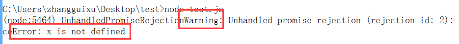

#### 3.3.3 catch()的返回值

没错，既然catch()是`.then(null, rejection)`的别名，那么catch()就会返回一个Promise对象，因此在后面还可以接着调用`then`方法，示例代码如下：

```javascript
var p = new Promise((resolve, reject) => {
    resolve(x + 2);
});
p.then( () => {
    console.log('nothing');
}).catch( err => {
    console.log(err.toString());
    return 'catch';
}).then( ret => {
    console.log(ret);
});
```

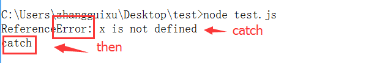

当出错时，catch会先处理之前的错误，然后通过return语句，将值继续传递给后一个then方法中。

如果没有报错，则跳过catch，示例如下：

```javascript
var p = new Promise((resolve, reject) => {
    resolve('p');
});
p.then( ret => {
    console.log(ret);
    return 'then1';
}).catch( err => {
    console.log(err.toString());
    return 'catch';
}).then( ret => {
    console.log(ret);
});
```

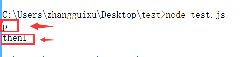

## 4. Promise对象方法

### 4.1 Promise.all()

Promise.all()方法用于将多个Promise实例，包装成一个新的Promise实例，例如

```javascript
var p = Promise.all([p1, p2, p3]);
```

新的Promise实例`p`的状态由`p1, p2, p3`决定：

* 当`p1, p2, p3`的状态都为`完成态`时，p为完成态。
* `p1, p2, p3`中任一一个状态为`失败态`，则p为失败态。

### 4.2 Promise.race()

Promise.race方法同样是将多个Promise实例，包装成一个新的Promise实例。

```javascript
var p = Promise.race([p1, p2, p3]);
```

不同的是，只要`p1, p2, p3`中任意一个实例率先改变状态，则`p`的状态就跟着改变，而且状态由率先改变的实例决定。


```javascript
var p = Promise.race([
    new Promise(resolve => {
        setTimeout(() => resolve('p1'), 10000);
    }),
    new Promise((resolve, reject) => {
        setTimeout(() => reject(new Error('time out')), 10);
    })
]);
p.then( ret => console.log(ret))
    .catch( err => console.log(err.toString()));
```

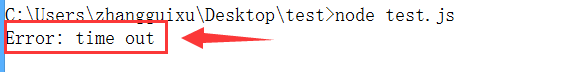

### 4.3  Promise.resolve()

Promise.resolve()可以将现有的对象转为Promise对象。

```javascript
var p = Promise.resolve('p');

// 相当于
var p = new Promise(resolve => resolve('p'));
```

比较有意思的是Promise.resolve()会根据参数类型进行相应的处理，分几种情况讨论。

#### 4.3.1 Promise实例

参数是一个Promise实例，那么Promise.resolve将不做任何处理，直接返回这个实例。

#### 4.3.2 thenable对象

参数是一个`thenable`对象，也就是说对象是具有`then`方法的对象，但不是一个Promise实例（就跟类数组和数组的关系一样），例如

```javascript
let thenable = {
    then : function (resolve, reject) {
        resolve(42);
    }
};

let p = Promise.resolve(thenable);
p.then( ret => console.log(ret)); // 42
```

Promise.resolve方法会将这个对象转为Promise对象，然后立即执行thenable对象中的then方法，因为例子中的thenable对象的then方法中执行了`resolve`，因此会输出结果`42`。

#### 4.3.3 其他参数

如果参数是一个原始值，或者不具有then方法的对象，则Promise.resolve方法返回一个新的Promise对象，状态为`resolve`，然后直接将该参数传递给`resolve`方法。

```javascript
var p = Promise.resolve("p");
p.then( ret => console.log(ret)); // p
```

#### 4.3.4 不带任何参数

Promise.resolve方法不带参数时，会直接返回一个`resolve`状态的Promise对象。

需要注意的立即`resolve`的Promise对象，是在本轮`事件循环`的结束时，而不是下一轮`事件循环`的开始执行。示例代码：

```javascript
setTimeout(() => console.log('3'), 0);
var p = Promise.resolve();
p.then(() => console.log('2'));
console.log('1');
```

输出结果为：

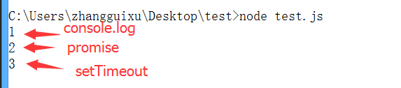

### 4.4 Promise.reject()

Promise.reject()返回一个新的Promise实例，该实例的状态为`rejected`，对于传入的参数的处理跟Promise.resolve类似，就是状态都为`rejected`。

## 5. 两个实用的方法

### 5.1 done()

Promise对象的回调链，不管以then方法或者catch方法结尾，要是最后一个方法抛出错误，都有可能无法捕捉到，因为Promise内部的错误不会冒泡到全局，因此，我们可以提供一个done方法，总是处理回调链的尾端，保证抛出任何可能出现的错误。

这个代码的实现非常简单

```javascript
Promise.prototype.done = function (resolve, reject) {
    this.then(resolve, reject)
        .catch( function (reason) {
            // 抛出一个全局错误
            setTimeout( () => { throw reason }, 0);
        });
}

// 使用示例
var p = new Promise( (resolve, reject) => {
    resolve('p');
});
p.then(ret => {
    console.log(ret);
    return 'then1';
}).catch( err => {
    console.log(err.toString());
}).then( ret => {
	console.log(ret);
    return 'then2';
}).then( ret => {
	console.log(ret);
    x + 2;
}).done();
```

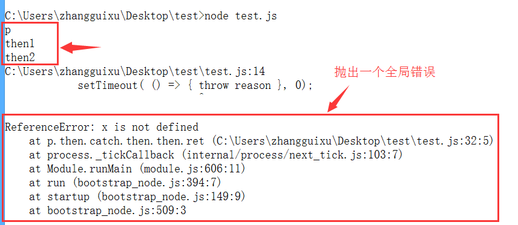

这里为什么可以在全局抛出一个错误？原因就是setTimeout中的回调函数是在`全局作用域中执行的`，因此抛出的错误就是在全局作用域上。

### 5.2 finally()

finally方法用于指定不管Promise对象最后的状态如何，都会执行的操作，它与done方法最大的区别就是，它接受一个普通函数作为参数，该函数不管怎么样都必须执行。

```javascript
Promise.prototype.finally = function (callback) {
    let P = this.constructor;
    return this.then(
        ret => P.resolve(callback()).then( () => ret),
        err => P.resolve(callback()).then( () => {throw reason })
    );
};
```

## 5. Promise的优劣势

从上面几个小节综合来看，可以看到Promise其实就是做了一件事情，那就是对异步操作进行了封装，然后可以将异步操作以同步的流程表达出来，避免了层层嵌套的回调函数，同时提供统一的接口，使得控制异步操作更加容易。

但是，Promise也有一些缺点：

* 无法取消Promise，一旦新建它就会立即执行，无法中途取消。
* 如果不设置回调函数，Promise内部的错误不会反应到外部。
* 当处于未完成态时，无法得知目前进展到哪一个阶段。

## 6. Promise与generator的结合

使用Generator函数来管理流程，遇到异步操作的时候，通常返回一个`Promise`对象。

```javascript
function getFoo() {
	return new Promise( resolve => resolve('foo'));
}

var g = function * () {
	try {
		var foo = yield getFoo();
		console.log(foo);
	} catch(e){}
}

function run(generator) {
	var it = generator();

	function go(result) {
		if(result.done) return result.value;

		// 默认value是一个Promise，其实这里应该做判断的
		if(!(result.value instanceof Promise)){
			throw Error('yield must follow an instanceof Promise');
		}
		return result.value.then(
			ret => go(it.next(ret))
		).catch(err => go(it.throw(err)));
	}

	go(it.next());
}

run(g);
```

上面代码的Generator函数g之中，有一个异步操作getFoo，它返回的就是一个Promise对象。函数run用来处理这个Promise对象，并调用下一个next方法。

## 来源

1. [ECMAScript 6入门-阮一峰](http://es6.ruanyifeng.com/#docs/promise)