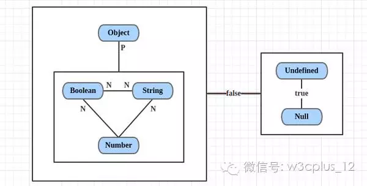

# ==运算符

我们都知道在js中==和===是不一样的，===才是绝对的相等，而==则会涉及隐性的类型转换之后，才会进行比较，那么当两个数采用==进行比较时，会有怎么样的一个类型转换的规律？

## 运算规则

*万物皆数*

记住这以下几个规则

* undefined == null => true，它们俩与其他值比较的结果是false
* String == Boolean，需要两个操作数同时转为Number
* String/Boolean == Number，需要转为Number
* Object == String/Number，Object通过toString()/valueOf()转为基本类型

## 来源

1. [通过一张简单的图，让你彻底搞懂JS的==运算](https://zhuanlan.zhihu.com/p/21650547)