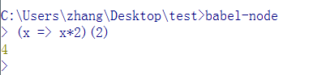

# babel

Babel是一个广泛使用的转码器，可以将ES6代码转为ES5代码，

## 1. 配置文件.babelrc

babel的配置文件`.bablerc`，存放在项目的根目录下，使用babel的第一步，就是配置这个文件。这个文件的作用是设置转码规则和插件：

```javascript
{
    "presets" : [],
    "plugins" : []
}
```

presets: 设定转码规则，有以下的规则集

```shell
# ES5 转码规则
npm install --save-dev babel-preset-es2015

# react转码规则
npm install --save-dev babel-preset-react

# es7 不同阶段语法提案的转码规则
npm install --save-dev babel-preset-stage-0
npm install --save-dev babel-preset-stage-1
npm install --save-dev babel-preset-stage-2
npm install --save-dev babel-preset-stage-3
```

然后将这些规则加入.babelrc

```javascript
{
    "preset" : ["es2015","react"]
}
```

*所有的babel工具和模块的使用，都必须先写好.babelrc*

## 2. 命令行转码babel-cli

babel提供babel-cli工具，用于命令行转码。安装如下：

```shell
npm install --global babel-cli
```

基本用法

```shell
# 转码结果输出到标准输出
$ babel example.js

# 转码结果写入一个文件
# --out-file 或 -o 参数指定输出文件
$ babel example.js --out-file compiled.js
# 或者
$ babel example.js -o compiled.js

# 整个目录转码
# --out-dir 或 -d 参数指定输出目录
$ babel src --out-dir lib
# 或者
$ babel src -d lib

# -s 参数生成source map文件
$ babel src -d lib -s
```

在实际项目中，进行babel转码，可以将babel-cli安装在项目，并指定为项目依赖包

```shell
npm install babel-cli --save-dev
```

然后在package.json配置命令

```javascript
{
    "scripts":{
        "build" : "babel src -d build"
    }
}
```

项目转码的时候，就只需要执行下面的命令

```shell
npm run build
```

## 3. babel-node

babel-cli工具自带一个babel-node命令（即不用单独安装，在安装babel-cli已经安装好了），提供一个支持ES6的REPL环境，它支持Node的REPL环境的所有功能，而且可以直接运行ES6代码。



或者可以直接运行ES6脚本。

```shell
babel-node es6.js
```

## 4. babel-register

babel-register模块改写了require命令，给它加上一个钩子，此后，每当使用require加载js、jsx、es、es6等后缀名的文件，就会先用babel进行转码。

```shell
npm install --save-dev babel-register
```

使用时，只需要先加载babel-register

```javascript
require("babel-register");
require("./index.js");
```

需要注意的是，babel-register只会对require命令加载的文件转码，而不会对当前文件转码，此外由于是它是实时转码，所以只适合在开发环境使用。

## 5. babel-core

如果某些代码需要调用babel的API进行转码，就要使用babel-core模块，

```shell
npm install babel-core --save
```

然后，在项目中就可以调用babel-core，配置的对象可以参看[官方文档](http://babeljs.io/docs/usage/options/)

```javascript
var es6Code = "let x=n => n+1";
var es5Code = require("babelc-core").transform(es6Code, {
    presets : ["es2015"]
}).code;
```

## 6. babel-polyfill

Babel默认只转换新的JavaScript句法，而不转换新的API，比如Iterator、Generator、Set、Maps、Proxy、Reflect等全局对象，以及一些定义在全局对象上的方法都不会转码。

```shell
npm install --save babel-polyfill
```

然后在脚本本部，加如一行代码

```javascript
import "babel-polyfill";
// or
require("babel-polyfill");
```

babel默认不转码的API非常多，可以查看[详细清单](https://github.com/babel/babel/blob/master/packages/babel-plugin-transform-runtime/src/definitions.js)


## 7. 浏览器环境

babel也可以用于浏览器环境，只需要

```html
<script src="node_modules/babel-core/browser.js"></script>
<script type="text/babel">
// Your ES6 code
</script>
```

*babel 6.0开始，不再直接提供浏览器版本，而是要用构建工具构建出来。*

## 8. 在线转换

可以在这里[体验新的js语法](https://babeljs.io/repl/)

## 来源

1. [babel入门教程](http://www.ruanyifeng.com/blog/2016/01/babel.html)
2. [babel官网](http://babeljs.cn/)