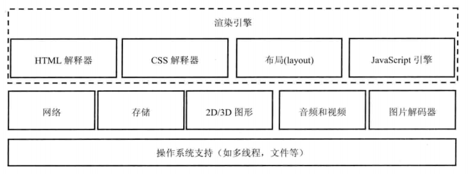
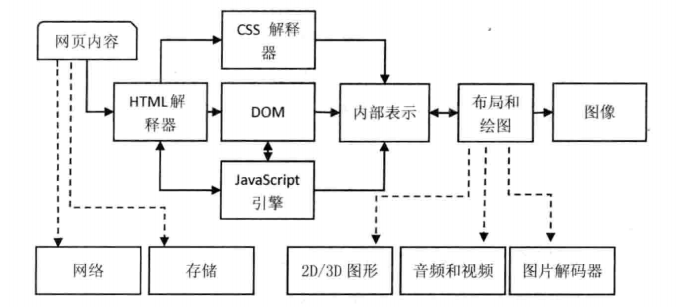
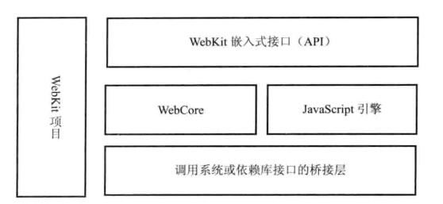
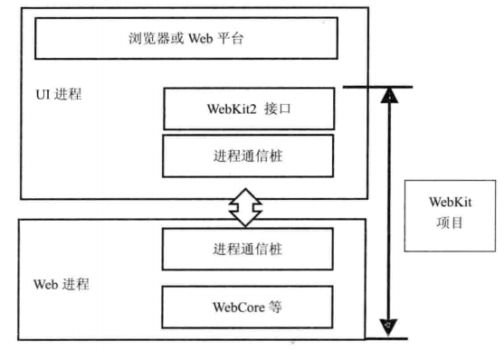

# 浏览器的功能

1. 网络，耗时比较长，而且需要安全访问互联网上的资源
2. 资源管理，管理从网络下载或者本体获取的资源，常见的问题有：如何避免重复下载资源、缓存资源等。
3. 网页浏览，关系到浏览器内核渲染问题。
4. 多页面管理，需要支持多页面浏览。
5. 插件和扩展。
6. 账户和同步。
7. 安全机制，提供一个安全的浏览器环境，避免用户信息被各种非法工具窃取和破坏。
8. 开发者工具。

# 用户代理和浏览器行为

用户代理（User Agent）的作用是表明浏览器的身份，从而互联网的内容供应商能够知道发生请求的浏览器的身份，浏览器能够支持什么样的功能，因此网页内容提供商可以为不同的浏览器发送不同的网页内容。

# 内核模块

一个渲染引擎主要包括

* HTML解释器：将HTML文本解释成DOM
* CSS解释器：级联样式表的解释器，为DOM中的各个元素对象计算出样式信息，从而为计算最后网页的布局提供基础设施。
* 布局：在DOM创建之后，webkit需要将其中的元素对象同样式信息结合起来，计算它们的大小位置等布局信息，形成一个能够表示这所有信息的内部表示模型。
* JavaScript引擎：JavaScript引擎能够解释JavaScript代码，并通过DOM接口和CSSOM接口来修改网页内容和样式信息，从而改变渲染的结果。
* 绘图：使用图形库将布局计算后的各个网页的节点绘制成图像结果。

一个典型的渲染过程如下：

# WebKit

## WebKit项目

Webkit项目的特点是结构清晰、易于维护、便于引入新移植的特性。

其模块图如下

## webkit/webkit2

在Chromium项目中，为了网页浏览环境的安全性和稳定性原因考虑而引入了跨进程架构后，Webkit项目也想有这方面的支持。

WebKit2便在这样的背景下诞生，它是一组支持新架构的全新绑定和接口层，该接口和调用者代码与网页的渲染工作代码不在同一进程。

WebKit2的进程结构模型：

## Blink

Blink从Webkit中分裂出来，Google希望未来在Blink中加入很多新的技术：

1. 实现跨进程的iframe。iframe允许网页中嵌入其他页面，存在潜在的安全问题，一个新的想法是为iframe创建一个单独的沙箱进程。
2. 重新整理和修改Webkit关于网络方面的架构和接口。
3. （大胆而激进的想法）将DOM树引入到JavaScript引擎中，原因是DOM和JavaScript引擎是分开的，导致JavaScript引擎访问DOM树需要额外的负担，影响了访问速度。
4. 性能方面的优化。
