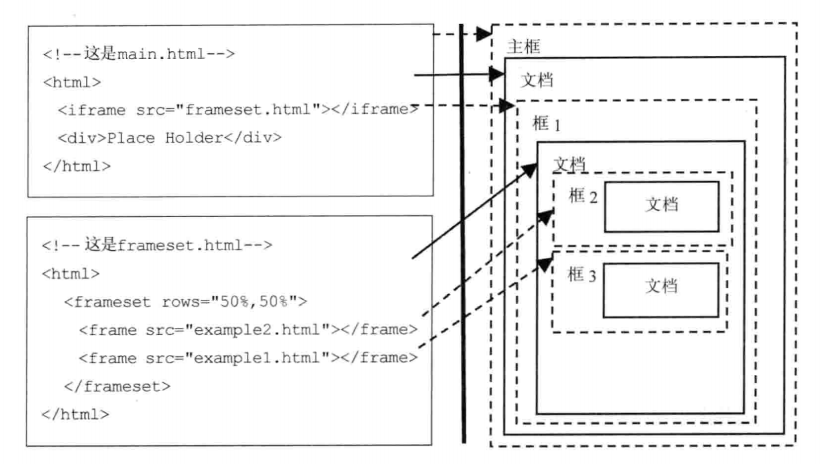
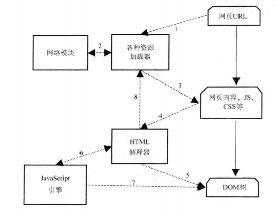
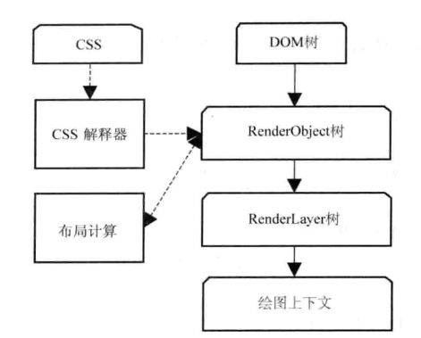
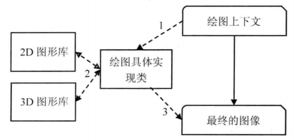

# 网页结构

HTML网页结构有三种特征：

* 树状结构
* 层次结构
* 框结构

## 框结构

在HTML语法中，使用`frameset`，`frame`，`iframe`来嵌入新的框结构。

如图所示是一个多框结构的网页。

## 层次结构

网页的层次结构是指网页中的元素可能分布在不同的层次中，也就是说某些元素可能不同于它的父元素所在的层次。

对于需要复杂变换和处理的元素，WebKit就会为它们构建新的层次，为的是渲染引擎在处理上的方便和高效。

# Webkit的网页渲染过程

根据数据的流向，这里将渲染过程分为三个阶段

## 1. 从网页的URL到构建完DOM树

1. 当输入网页URL时，WebKit调用资源加载器加载该URL对应的网页
2. 加载器依赖网络模块建立连接，发送请求并接受答复
3. WebKit接受到各种网页或者资源的数据，其中某些资源可能是同步或异步获取的
4. 网页被交给HTML解释器转变成一系列的词语(Token)
5. 解释器根据词语构建节点(Node)，形成DOM树
6. 如果节点是JavaScript代码，调用JavaScript引擎解释并执行
7. JavaScript代码可能会修改DOM树的结构
8. 如果节点需要依赖其他资源（图片、css、视频），调用资源加载器进行异步加载（不会阻碍当前DOM树的创建）；如果是JavaScript资源，且没有标记异步方式，则需停止当前DOM树的创建，直到JavaScript资源加载并解释执行之后，才继续DOM树的创建

在上述过程中，网页在加载和渲染过程中会发出两个事件，分别对应

* DOMContent：DOM树构建完成
* onload：DOM树构建完成且网页所依赖的资源都加载完成之后

## 2. 从DOM树到构建完WebKit的绘图上下文

构建完DOM树之后，WebKit利用CSS和DOM树构建`RenderObject`树直到绘图上下文

1. CSS文件被CSS解释器解释成内部表示结构
2. CSS解释器工作完之后，在DOM树上附加解释后的样式信息，即`RenderObject`树
3. RenderObject节点在创建的同时，WebKit会根据网页的层次结构创建`RenderLayer`树，同时构建一个虚拟的绘图上下文。

*RenderObject树的建立并不表示DOM树会被销毁，图中的四个内部表示结构一直存在，直到网页被销毁。*

## 3. 从绘图上下文到生成最终的图像

1. 绘图上下文是一个与平台无关的抽象类，它将每个绘图操作桥接到不同的具体实现类，也就是绘图具体实现类。
2. 绘图实现类的实现有可能简单，也有可能复杂。在Chromium中，它的实现相当复杂，需要Chromium的合成器来完成复杂的多进程和GPU加速机制。
3. 绘图实现类将2D或者3D图形库绘制的结果保存下来，和浏览器界面一起显示。

